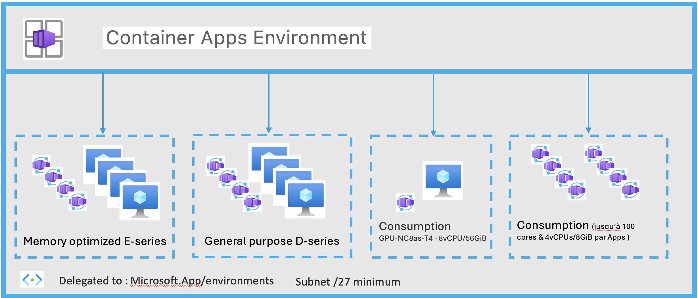

# Network-concept-in-Azure-Container-Apps
1. __Introduction__ </br>
On ne présente plus Azure Container Apps, pour rappel, Azure Container Apps est une plateforme serverless qui permet d'executer des applications modernes et des microservices à l'aide de conteneurs sans avoir à gérer d'infrastructure trop complexe. Ce service dans Azure s'appuie sur des technologies :<br>
- Kubernetes
- KEDA
- Envoy
- DAPR


<br>

2. __Environnement__ </br>
Les applications dans Azure Container Apps fonctionnent dans un contexte d'environnement qui s'exécute dans son propre réseau virtuel. Lorsque l'on créez un environnement Azure Container Apps, plusieurs éléments clés doivent être pris en compte pour déterminer les capacités réseau des applications conteneurisées:
- Type d'environnement
- Type de réseau virtuel
- Niveau d'accessibilité


a) __Environnement__<br>
Il existe deux types d'environnement:
- "Consumption only"
- "Workload profiles"


Pour l'environnement de type __"Consuption only"__<br>
Historiquement, c'est le premier type d'environnemnt qui était proposé lors de la création du service Azure Container Apps.<br>
L'environnement __"Consuption only"__ seul exécute l'application à l'aide de ressources de calcul exclusivement allouées à la demande. En d'autres termes, on paye que pour les ressources consommées par l'application. De plus les environnements "Consuption only" ont accès jusqu'à 4 vCPU avec 8 Go de mémoire par Apps avec les choix suivants<br>
<br>
Il n'y a pas d'accès aux GPU dans un environnement "Consuption only".


Pour l'environnement de  type __"Workload profiles"__<br>
Les "Workload profiles" permettent de disposer d'une capacité de calcul dédiée (mémoire et CPU) pour les applications déployées dans un environnement Container Apps.<br>
Microsoft prend en charge avec les "Workload profiles" des VM à usage général (General purpose D-series - jusqu'à 32vCPU/128GiB) et optimisés en mémoire (Memory optimized E-series - jusqu'à 32vCPU/256GiB). Microsoft propose également un "Workload profiles" des VM avec GPU (GPU-NC8as-T4 - 8vCPU/56GiB).<br>
En attribuant plusieurs "Workload profiles" à un environnement ACA, on peut gérer différents types de "workload". Par exemple, on peut garantir que les applications gourmandes en ressources s'exécutent sur du matériel adapté (General purpose D-series, Memory optimized E-series et GPU-NC8as-T4 ) et que les applications génériques s'exécutent sur un pool de ressources différent.<br>
Depuis la V2 de l'environnement "Workload profiles" il y a la possibilité de faire un mixte comme ci-dessous:<br><br>
<br>
Lorsque que l'on déploie un environnement (portail / AzCLI / autres) il est de base en "Workload profiles". Pour pouvoir déployer un environnement en "Consumption only" il faut déployer en Command Line/IaC ex AzCli: `az containerapp env create --name <> --resource-group <> --enable-workload-profiles false`

b) __Type de réseau virtuel__<br>
Par défaut, les applications conteneurisées sont intégrées au réseau Azure, un vnet et subnet sont déployés mais non visible dans la console Azure<br>
Dans la plupart du temps on intègrera un environnement Azure Container Apps dans un Vnet et Subnet existant (intergration avec d'autres service Azure ex: NSG, Application Gateway, AzFireWall, private point, etc ). Une fois que l'environnement est intégré dans un Vnet/Subnet on ne peut plus modifier !<br>
Les deux types d'environnements présentent également certaines différences très importantes au niveau du réseau.<br>
Pour un environnement "Workload profiles"<br>
Prise en charge :  des UDR, la sortie vers Internet via la NAT Gateway et la création de points de terminaison privés dans l'environnement d'application conteneurisé. La taille minimale requise du sous-réseau est /27.<br>
Pour un environnement "Consumption only"<br>
Ne prend pas charge : les UDR, la sortie vers Internet via la NAT Gateway, pas de peering via une gateway distante et pas d'autre custom egress. La taille minimale requise pour le sous-réseau est /23<br>


```
PREFIX="demo-network-aca"
LOCATION="westeurope"

az group create \
  --name "${PREFIX}-rg" \
  --location "$LOCATION"

az containerapp env create \
  --name "${PREFIX}-env" \
  --resource-group "${PREFIX}-rg" \
  --logs-destination none \
  --location "$LOCATION"

```


