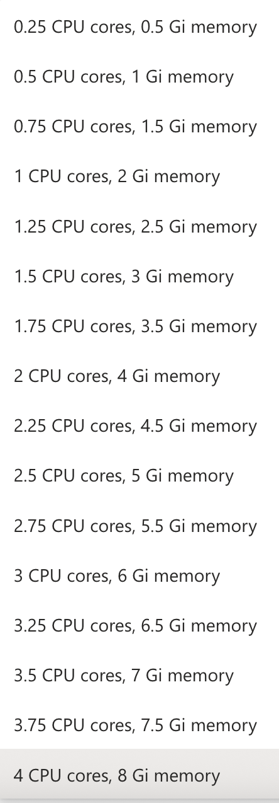
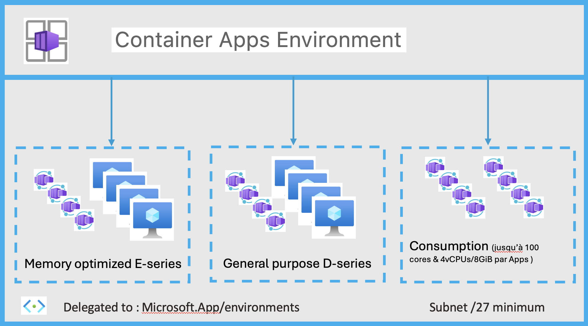

# Network-concept-in-Azure-Container-Apps
1. __Introduction__ </br>
Les applications dans Azure Container Apps fonctionnent dans un contexte d'environnement qui s'exécute dans son propre réseau virtuel. Lorsque l'on créez un environnement Azure Container Apps, plusieurs éléments clés doivent être pris en compte pour déterminer les capacités réseau des applications conteneurisées:
- Type d'environnement
- Type de réseau virtuel
- Niveau d'accessibilité


__Environnement__<br>
Il existe deux types d'environnement:
- "Consumption only"
- "Workload profiles"


Pour l'environnement de type __"Consuption only"__<br>
Historiquement, c'est le premier type d'environnemnt qui était proposé lors de la création du service Azure Container Apps<br>
L'environnement __"Consuption only"__ seule exécute l'application à l'aide de ressources de calcul exclusivement allouées à la demande.En d'autres termes, vous ne payez que pour les ressources consommées par votre application. De plus les environnements "Consuption only" ont accès jusqu'à 4 vCPU avec 8 Go de mémoire avec les choix suivants<br>
<br>
Il n'y a pas d'accès aux GPU dans un environnement Consommation uniquement.


Pour l'environnement de  type __"Workload profiles"__<br>
Les "Workload profiles" permettent de disposer d'une capacité de calcul dédiée (mémoire et CPU) pour les applications déployées dans un environnement Container Apps.<br>
Microsoft prend en charge avec les "Workload profiles" des VM à usage général (General purpose D-series - jusqu'à 32vCPU/128GiB) et optimisés en mémoire (Memory optimized E-series - jusqu'à 32vCPU/256GiB). Microsoft propose également un "Workload profiles" des VM avec GPU (GPU-NC8as-T4 - 8vCPU/56GiB).<br>
En attribuant plusieurs "Workload profiles" à un environnement ACA, on peut gérer différents types de "workload". Par exemple, on peut garantir que les applications gourmandes en ressources s'exécutent sur du matériel adapté (General purpose D-series, Memory optimized E-series et GPU-NC8as-T4 ) et que les applications génériques s'exécutent sur un pool de ressources différent.<br>
Depuis la V2 de l'environnement "Workload profiles" il y a la possibilité de faire un mixte comme ci-dessous:<br>
<br>


```
PREFIX="demo-network-aca"
LOCATION="westeurope"

az group create \
  --name "${PREFIX}-rg" \
  --location "$LOCATION"

az containerapp env create \
  --name "${PREFIX}-env" \
  --resource-group "${PREFIX}-rg" \
  --logs-destination none \
  --location "$LOCATION"

```


